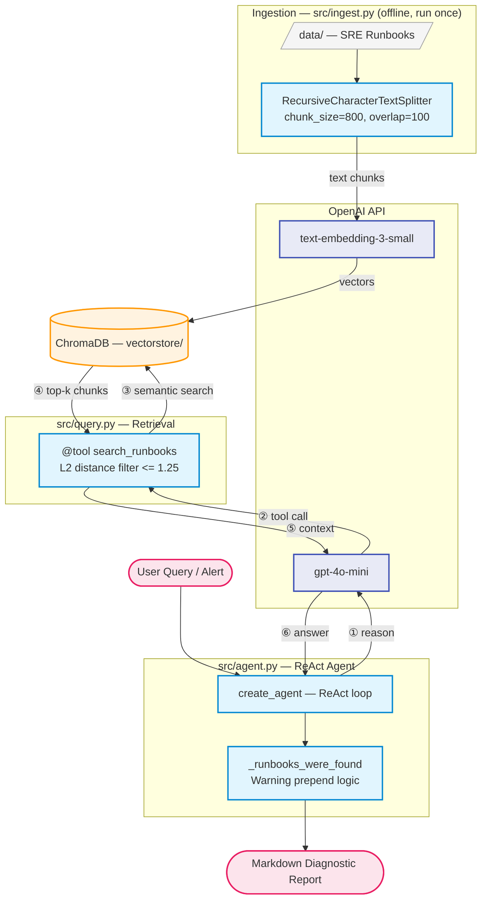

# sre-agent

Proof of Concept for an AI-powered SRE (Site Reliability Engineering) agent, developed as a Master's Thesis in Artificial Intelligence (Alfonso X el Sabio University).

The system uses a **ReAct (Reasoning and Acting) Agent** architecture backed by a **RAG pipeline**. It ingests SRE runbooks, embeds them in a vector database, and uses an LLM-powered agent that autonomously reasons about incidents — consulting the runbooks when relevant and combining them with its own domain knowledge to produce detailed Markdown diagnostic reports.

## Core Objectives & Scope

1. **Core Objective**: A ReAct (Reasoning and Acting) Agent that autonomously investigates Kubernetes incidents, using the official runbooks as its source of truth.
2. **Infrastructure**: The agent is deployed within a Kubernetes cluster (Kind/Minikube) with direct access to the K8s API for logs/events, and connects to monitoring systems (e.g., Prometheus) to react to microservice metrics.
3. **Technical Scope**:
   - **Automatic Analysis and Diagnosis** (High Priority)
   - **Generation of Detailed SRE Reports** (High Priority)
   - **Execution of Corrective Actions** (Nice-to-have / Future Phase)

## Architecture



## Goals

The success of this agent will be evaluated based on the following metrics:

- **Diagnostic Precision**: Accuracy of the automated diagnosis compared to human-led investigations.
- **MTTR Reduction**: The potential decrease in Mean Time To Resolution by automating the initial triage, log gathering, and runbook correlation.

## Prerequisites

- [Mamba](https://mamba.readthedocs.io/) (or Conda)
- An **OpenAI** API key with access to the `text-embedding-3-small` model

## Installation

```bash
# 1. Clone the repository
git clone git@github.com:arialdev/sre-agent.git
cd sre-agent

# 2. Create the environment
mamba env create -f environment.yml

# 3. Activate the environment
mamba activate sre-agent
```

## Configuration

Create a `.env` file in the project root with your OpenAI API key:

```env
OPENAI_API_KEY=sk-...
```

> **Note:** The `.env` file is already included in `.gitignore` and will never be pushed to the repository.

## Usage

### 1. Ingest the runbooks

Loads runbooks from `data/`, splits them into chunks, generates embeddings, and persists them to `vectorstore/`:

```bash
python -m src.ingest
```

Expected output:

```bash
Loaded 3 documents, split into N chunks.
Vectorstore persisted to /path/to/project/vectorstore
```

### 2. Run the agent

Pass an error description, log line, or alert message and the ReAct agent will autonomously diagnose the issue:

```bash
python -m src.agent "ECONNREFUSED error on port 5432 in production logs"
python -m src.agent "high cpu usage in production pods"
```

The agent will:

1. Reason about the problem
2. Search the runbooks for relevant procedures
3. Combine runbook knowledge with its own SRE expertise
4. Output a structured Markdown diagnostic report

### 3. Query the vectorstore (legacy)

For direct retrieval without the agent loop, you can still use the legacy query pipeline:

```bash
python -m src.query "The latency surpasses the SLO thresholds"
```

## Project Structure

```bash
sre-agent/
├── environment.yml         # Mamba environment (Python 3.11 + dependencies)
├── .env                    # OpenAI API key (not versioned)
├── data/                   # SRE runbooks in Markdown
│   ├── db_connection_refused.md
│   ├── high_cpu_microservice.md
│   └── redis_cache_eviction.md
├── src/
│   ├── __init__.py
│   ├── agent.py            # ReAct agent: reason → search runbooks → diagnose
│   ├── ingest.py           # Ingestion pipeline: load → split → embed → persist
│   └── query.py            # Retrieval pipeline + search_runbooks tool
└── vectorstore/            # Local ChromaDB store (generated, not versioned)
```

## Required API Keys

| Service | Environment Variable | Purpose                                                                       |
|---------|----------------------|------------------------------------------------------------------------------ |
| OpenAI  | `OPENAI_API_KEY`     | Embedding generation (`text-embedding-3-small`) and agent LLM (`gpt-4o-mini`) |

## Main Dependencies

| Package               | Purpose                                                           |
| --------------------- | ----------------------------------------------------------------- |
| `langchain`           | Agent orchestration framework (ReAct agent via `create_agent`)    |
| `langchain-openai`    | OpenAI integration (embeddings + chat model)                      |
| `langchain-community` | Loaders (DirectoryLoader, TextLoader)                             |
| `langchain-chroma`    | ChromaDB vectorstore integration                                  |
| `chromadb`            | Local vector database with on-disk persistence                    |
| `python-dotenv`       | Load environment variables from `.env`                            |
